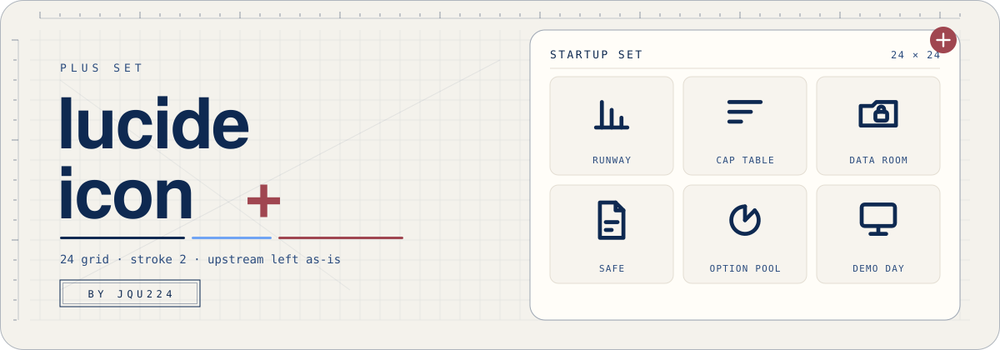

<div align="center">

</div>

<div align="center">
<pre>~/lucide-icon-plus (main*)  0 plus icons  24px stroke</pre>
</div>

<div align="center">

[](README.md)
[](README.zh-CN.md)

</div>

## lucide-icon-plus

Stroke icons for the gaps on a startup path.

— Same 24×24 stroke. Lucide's engine. Upstream icons stay untouched.

[](LICENSE)
[](docs/assets/hero.svg)
[](README.md)
[](https://github.com/lucide-icons/lucide)
[](README.md)

A public plus set of Lucide-compatible SVGs for screens a company needs while it is being built.

**Tips for getting started**

1. Read the icon contract below before drawing.
2. Add a missing stroke as `icons/<name>.svg`.
3. Keep importing Lucide for every icon it already ships. This repository only grows the plus set.

---

## Positioning

| | |
| --- | --- |
| **Who** | Product UI that already uses Lucide and needs a startup icon Lucide does not ship |
| **Job** | Draw that icon in Lucide's stroke and compile it with Lucide's icon build |
| **Boundary** | Lucide's existing icons stay in the Lucide repository, unmodified |

## Pipeline

```text
missing stroke
    → icons/<name>.svg      24×24, stroke 2, round caps
    → Lucide icon build     this repo's files only
    → import beside lucide  stock icons still come from lucide
```

| Step | What it does | Gate |
| --- | --- | --- |
| 1. Notice the gap | A screen needs a stroke that is not in Lucide | If Lucide has the icon, import Lucide |
| 2. Draw | Add `icons/<name>.svg` on the 24 grid | `fill="none"`, stroke width 2, round cap and join |
| 3. Build | Pass this set through Lucide's icon build | The build input is `icons/` here, not a patched Lucide tree |
| 4. Ship | Import the plus icon next to stock Lucide icons | The published Lucide package stays as released |

## Repository layout

| Path | Role |
| --- | --- |
| `icons/` | Plus SVGs. The directory arrives with the first icon |
| `docs/assets/hero.svg` | README banner |
| `LICENSE` | MIT, copyright jqu224 |

## Contract

| Rule | Meaning |
| --- | --- |
| Canvas | `viewBox="0 0 24 24"`, `fill="none"`, `stroke="currentColor"`, `stroke-width="2"`, round cap and join |
| Names | One kebab-case name per file. Skip the name when Lucide already publishes it |
| Upstream | Do not vendor, rename, or edit icons from the Lucide repository |
| Engine | Lucide's icon build compiles the plus set. The stroke style stays Lucide's |

```xml
<svg
  xmlns="http://www.w3.org/2000/svg"
  width="24"
  height="24"
  viewBox="0 0 24 24"
  fill="none"
  stroke="currentColor"
  stroke-width="2"
  stroke-linecap="round"
  stroke-linejoin="round"
>
  <path d="..." />
</svg>
```

## Usage

| Action | How |
| --- | --- |
| Add an icon | Create `icons/<name>.svg` with the contract above |
| Use Lucide's engine | Point Lucide's icon build at `icons/` in this repo |
| Use an icon Lucide ships | Import it from `lucide`. Leave it out of `icons/` |
| Count | `0` plus icons in this tree today |

## License

[MIT](LICENSE)
